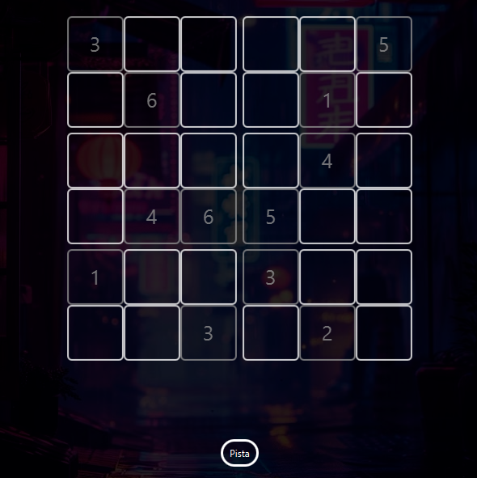

# 🧩 SudokuFX - Mini Proyecto 2
 
<p align="center">
  
  
  
</p>

> **An interactive 6x6 Sudoku game built with JavaFX!**

## 📌 Features
✅ Randomly generated Sudoku board (6x6 with 2x3 subgrids)  
✅ Backtracking algorythm to recognize multiple solutions
✅ Hints system to assist players  
✅ Validity check for user inputs  
✅ Solution verification & automatic correction  
✅ Win detection with animated feedback  
✅ Interactive and responsive UI  

## 🚀 Getting Started

### 1️⃣ Clone the repository
```bash
git clone https://github.com/GG2R10/SudokuFX.git
cd SudokuFX
```

### 2️⃣ Run the project
Open the project in **IntelliJ IDEA** and run the `Main` class.

Alternatively, use:
```bash
./gradlew run  # If using Gradle
```

## 🖥️ Screenshot


## 🛠️ Built With
- **Java 17 (Amazon Corretto)**
- **JavaFX** for UI
- **FXML** for layout
- **CSS** for styling
- **IntelliJ IDEA** as IDE
- **Git & GitHub** for version control

## 🏆 How to Play
1. Fill the grid with numbers from **1 to 6**.
2. Each row, column, and **2x3 block** must contain unique numbers.
3. Use the **hint button** if you're stuck!
4. Solve the entire board correctly to win! 🎉

## 👥 Team
<table align="center">
  <tr>
    <td align="center">
      <br>
      <strong>Conseq</strong>
    </td>
    <td align="center">
      <br>
      <strong>Captain Arias</strong>
    </td>
  </tr>
</table>


## 📝 License
This project is licensed under the **MIT License**. Feel free to use and modify it!

---
⭐ **If you like this project, don't forget to give it a star on GitHub!** ⭐
